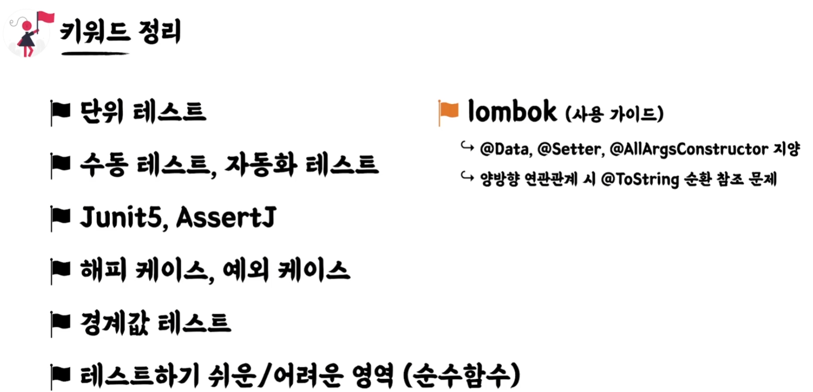
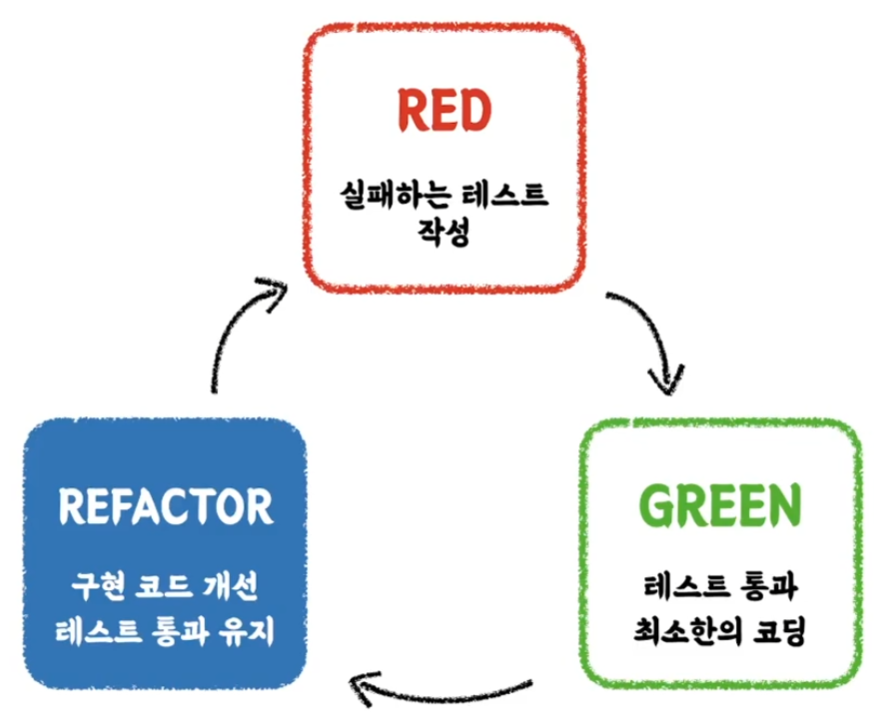
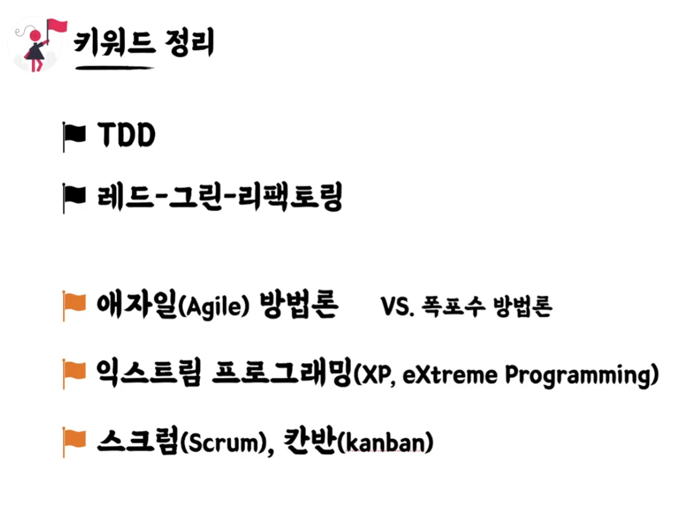
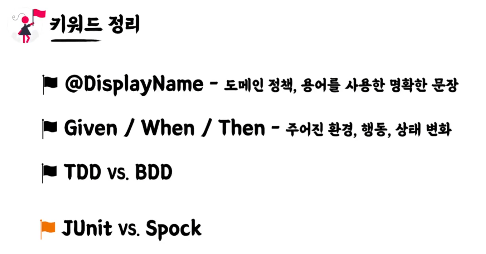
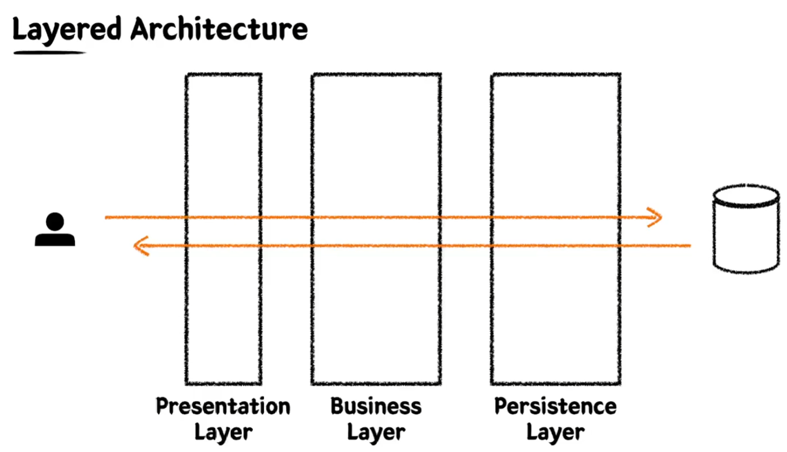
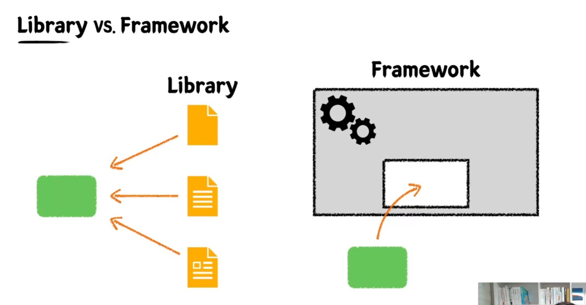
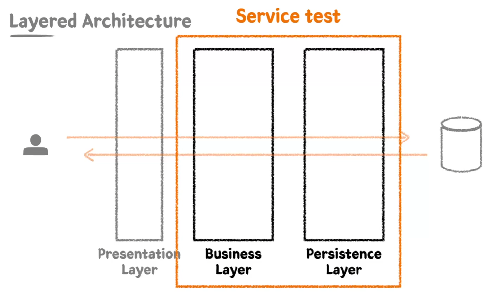

## JUnit5
유명한 소프트웨어 개발자인 켄트백이 만든 XUnit에서 유래 > Java Unit => JUnit
https://junit.org/junit5/docs/current/user-guide/

## AssertJ
테스트 코드 작성을 원할하게 돕는 케스트 라이브러리
메서드 체이닝 기법 지원

## 테스트 케이스 세분화하기
질문하기: 암묵적이거나 아직 드러나지 않은 요구사항이 있는가?

## 테스트 케이스 세분화 하기
    - 해피케이스 : 요구사항을 그대로 만족하는 테스트
    - 예외케이스 : 예외 케이스에 대한 테스트
    - 둘 모두 경계값에 대한 테스트가 가장 중요하다.

## 테스트하기 어려운 영역을 분리하기
가게 운영 시간(10:00~22:00) 외에는 주문을 생성할 수 없다.
- 관측할 때마다 다른 값에 의존하는 코드
  - 현재 날짜 / 시간, 랜덤 값, 전역 변수 / 함수, 사용자 입력 등 

- 외부 세계에 영향을 주는 코드
  - 표준 출력(로그), 이메일 또는 메시지 발송, 데이터베이스에 기록하기 등.

- 테스트 하기 쉬운 코드 : `순수 함수 (pure functions)`
  - 같은 입력에서는 항상 같은 결과
  - 외부 세상과 단절된 형태
  - 테스트하기 쉬운 코드

## TDD
프로덕션 코드보다 테스트 코드를 먼저 작성하여
테스트가 구현 과정을 주도하도록 하는 방법론
red -> green -> blue

## 선 기능 구현, 후 테스트 작성 할 시의 예상되는 문제점
  - 테스트 자체의 누락 가능성
  - 특정 테스트 케이스만 검증할 가능성 (해피케이스만 구현, 예외 케이스 누락)
  - 잘못된 구현을 다소 늦게 발견할 가능성

## TDD 장점
- 과감한 리팩토링이 가능해진다.
- 구현에 대한 빠른 피드백을 받을 수 있다.
- 쉽게 발견하기 어려운 엣지(edge) 케이스를 놓치지 않게 해준다.
- 복잡도가 낮은 (유연하며 ,유지보수가 쉬운), 테스트 가능한 코드로 구현하게 해준다.
- 테스트와 상호 작용하용을 통해 더욱 좋은 구현부 코드를 만들 수 있게 해준다.
- 

## 테스트는 문서다
  - 프로덕션 기능을 설명하는 테스트 코드 문서
  - 다양한 테스트 케이스를 통해 프로덕션 코드를 이해하는 시각과 관점을 보완
  - 어느 한 사람이 과거에 경험했던 고민의 결과물을 팀 차원으로 승격시켜서, 모두의 자산으로 공유할 수 있다.

## DisplayName을 섬세하게  
  - 명사의 나열보다 문장으로 : 음료 1개 추가 테스트 > 음료를 1개 추가할 수 있다.
  - 테스트 행위에 대한 결과까지 기술하기 : 음료 1개 추가 테스트 > 음료 1개를 추가하면 주문 목록에 담긴다. 
  - 메서드 관점보다 정책 관점으로 : 특정 시간 이전에 주문을 생성하면 실패한다. > 영업 시작 시간 이전에는 주문을 생성할 수 없다.
  

## BDD (Behavior Driven Development)
  - TDD에서 파생된 개발 방법
  - 함수 단위의 테스트에 집중하기보다, 시나리오에 기반한 테스트케이스 (TC) 자체에 집중하여 테스트한다.
  - 개발자가 아닌 사람이 봐도 이해할 수 있을 정도의 추상화 수준(레벨)을 권장

- GIVEN: 시나리오 진행에 필요한 모든 준비 과정 (객체, 값, 상태 등)
- WHEN: 시나리오 진행 행동
- THEN: 시나리오 진행에 대한 결과 명시, 검증
- DisplayName에 명확하게 문장을 작성할 수 있도록 해준다.

## SPOCK 
  - test framework
  - junit5와 비교 많이 되는 프레임워크입니다.
  - spckframework.org
  - java가 아니라 groovy 언어임
  - bdd 프레임 워크임
  - junit을 사용하면 주석으로 give when then 섹션으로 나눴는데
  - 얘는 탄생자체가 bdd라서 given when then을 문법으로 만들어져있다.

## Layered Architecture
  - 스프링에서 가장 많이 사용되는 아키텍처
  - 일반적으로 3개 layer
  - persistence layer 하위에 infrastructure layer를 두고 4개의 layer로 보는 곳도 있다.
  - 관심사의 분리하기 위해서 layer를 분리한다. 
  - 책임을 나눠, 유지 보수를 용이하게 하자

## 통합테스트 (Integration test)
  - 단위 테스트만으로는 커버하기 어려운 영역 (여러 객체 or 여러 모듈이 협력하게 되면서)
  - 시나리오 단위의 테스트 (layer 단위의 테스트)
  - 여러 모듈이 협력하는 기능을 통합적으로 검증하는 테스트
  - 일반적으로 작은 범위의 단위 테스트만으로는 기능 전체의 신뢰성을 보장할 수 없다.
  - 풍부한 단위 테스트 & 큰 기능 단위를 검증하는 통합 테스트

## Library vs Framework
  - library는 내 코드가 주체가 된다. 필요한 기능은 외부에서 끌어오는데 이때 외부를 library라고 한다.
  - framework는 이미 동작할 수 있는 환경들이 구성되어 있고 거기에 내 코드가 들어가는 수동적인 존재가 된다.

## Spring framework 
  - IoC (Inversion of Control)
    - 스프링 만의 개념은 아니다. 다른 기술에서도 이미 존재하는 것이다.
    - DI와 관계가 깊다.
    - 객체의 생명주기에 대한 관리를 제 3자가 할께 (IoC container)

  - DI  (Dependency Injection)
    - 

  - AOP (Aspect Oriented Programming)
    - 비즈니스와 관계없는 프로그래밍 부분
    - 스프링에서는 프록시를 사용해서 구현
    - 로깅, 트랜잭션

- ORM
  - 객체 지향 패러다임과 관계형 DB 패러다임의 불일치
  - 개발자들이 객체지향적으로 잘 짜놓고 DB에 넣을때는 필드로 분리해서 매핑하는 작업을 했음
  - ORM을 사용함으로써 개발자는 단순 작업을 줄이고, 비즈니스 로직에 집중할 수 있다.

- JPA
  - Java 진영의 ORM 기줄 표준
  - 인터페이스이고, 여러 구현체가 있지만 보통 Hibernate를 많이 사용한다.
  - 반복적인 CRUD SQL을 생성 및 실행해주고, 여러 부가 기능들을 제공한다.
  - 편리하지만 쿼리를 직접 작성하지 않기 때문에, 어떤 식으로 쿼리가 만들어지고 실행되는지 명확하게 이해하고 있어야 한다.
  - Spring 진영에서는 JPA를 한번 더 추상화한 Spring Data JPA 제공
  - QueryDSL과 조합하여 많이 사용한다. (타입체크, 동적쿼리에 대한 장점이 많기 떄문에)
  - @Entity, @Id, @Column
  - @ManyToOne, @OneToMany, @OneToOne, @ManyToMany (일대다 - 다대일 관계로 풀어서 사용)

- 요구사항
  - 키오스크 주문을 위한 상품 후보 리스트 조회하기
  - 상품의 판매 상태: 판매중, 판매보류, 판매중지
    - 판매중, 판매 보류인 상태의 상품을 화면에 보여준다.
  - id, 상품 번호, 상품 타입, 판매 상태, 상품 이름, 가격

## Persistence Layer 
    - Data Access의 역할
    - 비즈니스 가공 로직이 포함되어서는 안된다.
    - Data에 대한 CRUD에만 집중한 레이어

## Buisiness Layer
    - 비즈니스 로직을 구현하는 역할
    - Persistence Layer와의 상호작용 (Data를 읽고 쓰는 행위)을 통해 비즈니스 로직을 전개시킨다.
    - 트랜잭션을 보장해야 한다.

- 요구사항
  - 상품 번호 리스트를 받아 주문 생성하기
  - 주문은 주문 상태, 주문 등록 시간을 가진다.
  - 주문의 총 금액을 계산할 수 있어야 한다.