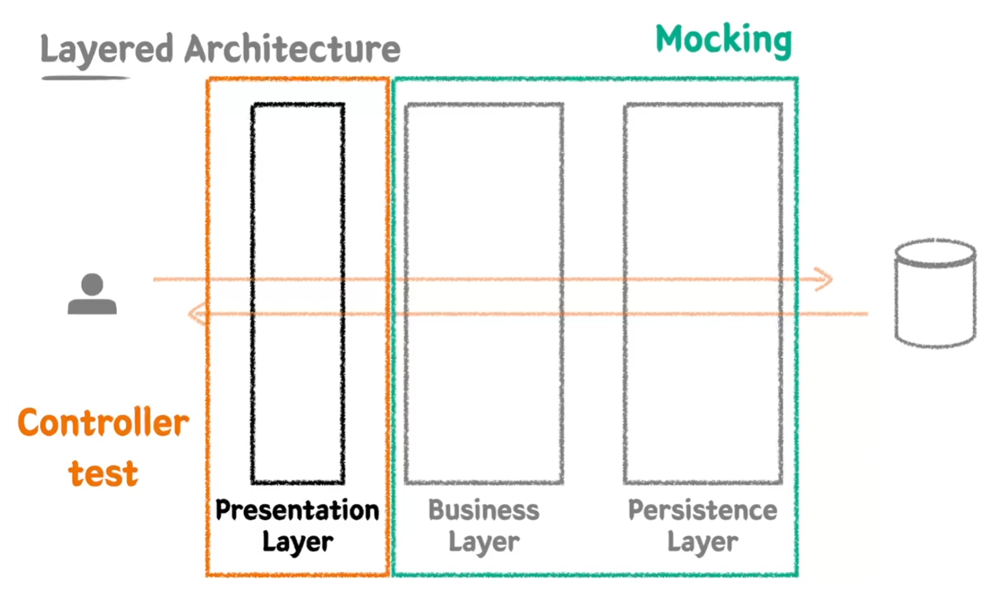
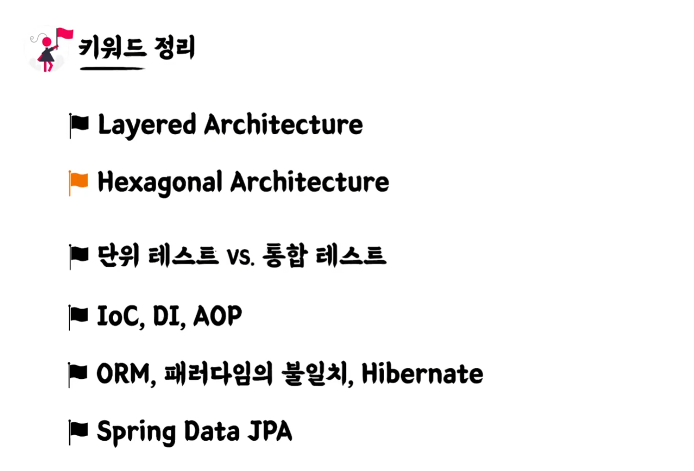
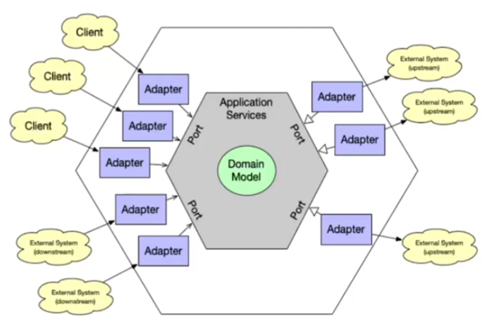
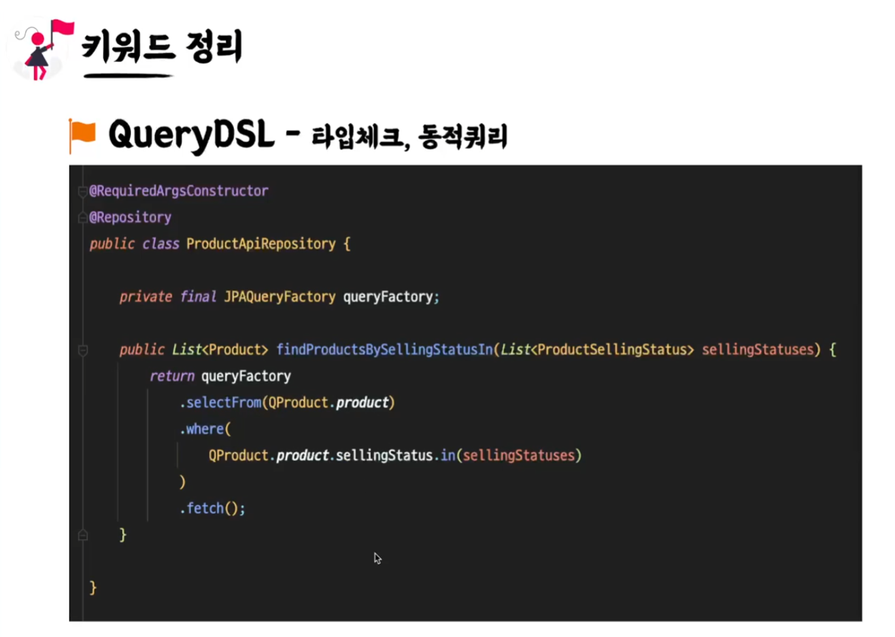
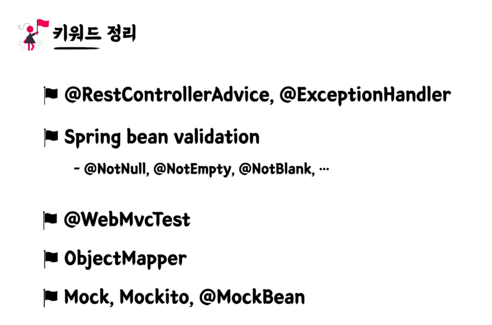
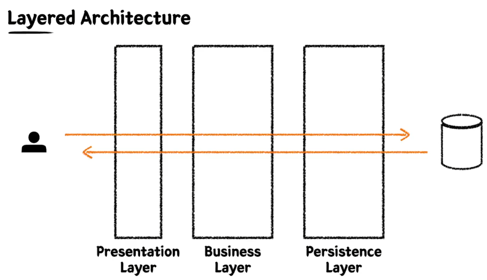
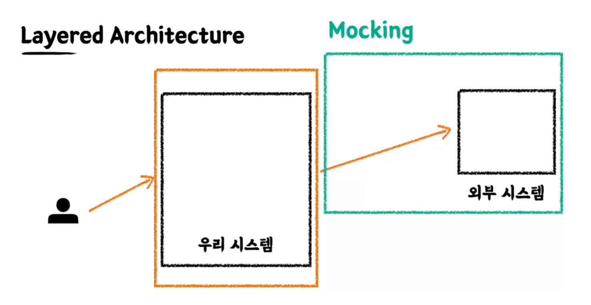
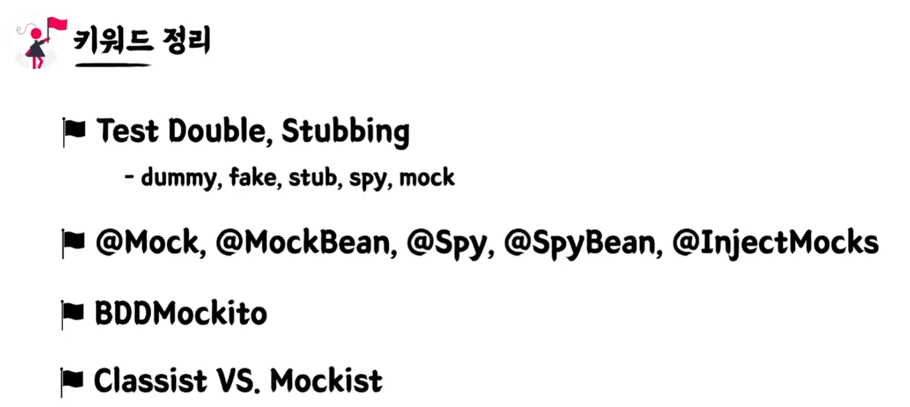

## JUnit5
유명한 소프트웨어 개발자인 켄트백이 만든 XUnit에서 유래 > Java Unit => JUnit
https://junit.org/junit5/docs/current/user-guide/

## AssertJ
테스트 코드 작성을 원할하게 돕는 케스트 라이브러리
메서드 체이닝 기법 지원

## 테스트 케이스 세분화하기
질문하기: 암묵적이거나 아직 드러나지 않은 요구사항이 있는가?

## 테스트 케이스 세분화 하기
    - 해피케이스 : 요구사항을 그대로 만족하는 테스트
    - 예외케이스 : 예외 케이스에 대한 테스트
    - 둘 모두 경계값에 대한 테스트가 가장 중요하다.

## 테스트하기 어려운 영역을 분리하기
가게 운영 시간(10:00~22:00) 외에는 주문을 생성할 수 없다.
- 관측할 때마다 다른 값에 의존하는 코드
  - 현재 날짜 / 시간, 랜덤 값, 전역 변수 / 함수, 사용자 입력 등 

- 외부 세계에 영향을 주는 코드
  - 표준 출력(로그), 이메일 또는 메시지 발송, 데이터베이스에 기록하기 등.

- 테스트 하기 쉬운 코드 : `순수 함수 (pure functions)`
  - 같은 입력에서는 항상 같은 결과
  - 외부 세상과 단절된 형태
  - 테스트하기 쉬운 코드

## TDD
프로덕션 코드보다 테스트 코드를 먼저 작성하여
테스트가 구현 과정을 주도하도록 하는 방법론
red -> green -> blue

## 선 기능 구현, 후 테스트 작성 할 시의 예상되는 문제점
  - 테스트 자체의 누락 가능성
  - 특정 테스트 케이스만 검증할 가능성 (해피케이스만 구현, 예외 케이스 누락)
  - 잘못된 구현을 다소 늦게 발견할 가능성

## TDD 장점
- 과감한 리팩토링이 가능해진다.
- 구현에 대한 빠른 피드백을 받을 수 있다.
- 쉽게 발견하기 어려운 엣지(edge) 케이스를 놓치지 않게 해준다.
- 복잡도가 낮은 (유연하며 ,유지보수가 쉬운), 테스트 가능한 코드로 구현하게 해준다.
- 테스트와 상호 작용하용을 통해 더욱 좋은 구현부 코드를 만들 수 있게 해준다.
- 

## 테스트는 문서다
  - 프로덕션 기능을 설명하는 테스트 코드 문서
  - 다양한 테스트 케이스를 통해 프로덕션 코드를 이해하는 시각과 관점을 보완
  - 어느 한 사람이 과거에 경험했던 고민의 결과물을 팀 차원으로 승격시켜서, 모두의 자산으로 공유할 수 있다.

## DisplayName을 섬세하게  
  - 명사의 나열보다 문장으로 : 음료 1개 추가 테스트 > 음료를 1개 추가할 수 있다.
  - 테스트 행위에 대한 결과까지 기술하기 : 음료 1개 추가 테스트 > 음료 1개를 추가하면 주문 목록에 담긴다. 
  - 메서드 관점보다 정책 관점으로 : 특정 시간 이전에 주문을 생성하면 실패한다. > 영업 시작 시간 이전에는 주문을 생성할 수 없다.
  

## BDD (Behavior Driven Development)
  - TDD에서 파생된 개발 방법
  - 함수 단위의 테스트에 집중하기보다, 시나리오에 기반한 테스트케이스 (TC) 자체에 집중하여 테스트한다.
  - 개발자가 아닌 사람이 봐도 이해할 수 있을 정도의 추상화 수준(레벨)을 권장

- GIVEN: 시나리오 진행에 필요한 모든 준비 과정 (객체, 값, 상태 등)
- WHEN: 시나리오 진행 행동
- THEN: 시나리오 진행에 대한 결과 명시, 검증
- DisplayName에 명확하게 문장을 작성할 수 있도록 해준다.

## SPOCK 
  - test framework
  - junit5와 비교 많이 되는 프레임워크입니다.
  - spckframework.org
  - java가 아니라 groovy 언어임
  - bdd 프레임 워크임
  - junit을 사용하면 주석으로 give when then 섹션으로 나눴는데
  - 얘는 탄생자체가 bdd라서 given when then을 문법으로 만들어져있다.

## Layered Architecture
  - 스프링에서 가장 많이 사용되는 아키텍처
  - 일반적으로 3개 layer
  - persistence layer 하위에 infrastructure layer를 두고 4개의 layer로 보는 곳도 있다.
  - 관심사의 분리하기 위해서 layer를 분리한다. 
  - 책임을 나눠, 유지 보수를 용이하게 하자

## 통합테스트 (Integration test)
  - 단위 테스트만으로는 커버하기 어려운 영역 (여러 객체 or 여러 모듈이 협력하게 되면서)
  - 시나리오 단위의 테스트 (layer 단위의 테스트)
  - 여러 모듈이 협력하는 기능을 통합적으로 검증하는 테스트
  - 일반적으로 작은 범위의 단위 테스트만으로는 기능 전체의 신뢰성을 보장할 수 없다.
  - 풍부한 단위 테스트 & 큰 기능 단위를 검증하는 통합 테스트

## Library vs Framework
  - library는 내 코드가 주체가 된다. 필요한 기능은 외부에서 끌어오는데 이때 외부를 library라고 한다.
  - framework는 이미 동작할 수 있는 환경들이 구성되어 있고 거기에 내 코드가 들어가는 수동적인 존재가 된다.

## Spring framework 
  - IoC (Inversion of Control)
    - 스프링 만의 개념은 아니다. 다른 기술에서도 이미 존재하는 것이다.
    - DI와 관계가 깊다.
    - 객체의 생명주기에 대한 관리를 제 3자가 할께 (IoC container)

  - DI  (Dependency Injection)
    - 

  - AOP (Aspect Oriented Programming)
    - 비즈니스와 관계없는 프로그래밍 부분
    - 스프링에서는 프록시를 사용해서 구현
    - 로깅, 트랜잭션

- ORM
  - 객체 지향 패러다임과 관계형 DB 패러다임의 불일치
  - 개발자들이 객체지향적으로 잘 짜놓고 DB에 넣을때는 필드로 분리해서 매핑하는 작업을 했음
  - ORM을 사용함으로써 개발자는 단순 작업을 줄이고, 비즈니스 로직에 집중할 수 있다.

- JPA
  - Java 진영의 ORM 기줄 표준
  - 인터페이스이고, 여러 구현체가 있지만 보통 Hibernate를 많이 사용한다.
  - 반복적인 CRUD SQL을 생성 및 실행해주고, 여러 부가 기능들을 제공한다.
  - 편리하지만 쿼리를 직접 작성하지 않기 때문에, 어떤 식으로 쿼리가 만들어지고 실행되는지 명확하게 이해하고 있어야 한다.
  - Spring 진영에서는 JPA를 한번 더 추상화한 Spring Data JPA 제공
  - QueryDSL과 조합하여 많이 사용한다. (타입체크, 동적쿼리에 대한 장점이 많기 떄문에)
  - @Entity, @Id, @Column
  - @ManyToOne, @OneToMany, @OneToOne, @ManyToMany (일대다 - 다대일 관계로 풀어서 사용)

- 요구사항
  - 키오스크 주문을 위한 상품 후보 리스트 조회하기
  - 상품의 판매 상태: 판매중, 판매보류, 판매중지
    - 판매중, 판매 보류인 상태의 상품을 화면에 보여준다.
  - id, 상품 번호, 상품 타입, 판매 상태, 상품 이름, 가격

## Persistence Layer 
    - Data Access의 역할
    - 비즈니스 가공 로직이 포함되어서는 안된다.
    - Data에 대한 CRUD에만 집중한 레이어

## Buisiness Layer
    - 비즈니스 로직을 구현하는 역할
    - Persistence Layer와의 상호작용 (Data를 읽고 쓰는 행위)을 통해 비즈니스 로직을 전개시킨다.
    - 트랜잭션을 보장해야 한다.

- 요구사항
  - 상품 번호 리스트를 받아 주문 생성하기
  - 주문은 주문 상태, 주문 등록 시간을 가진다.
  - 주문의 총 금액을 계산할 수 있어야 한다.

## 확인 point
    - OrderService > orderCreate() 에서 살펴보면 Order가 저장될 떄 OrderProduct가 같이 저장되는 모습을 확인할 수 있다.
    - deleteAll을 사용하지 않고 deleteAllInBatch를 사용

## Test는 @SpringBootTest와 @DataJpaTest가 있음
    - @DataJpaTest
        - 내부에 @Transactional이 있어서 테스트가 끝날때 마다 rollback이 진행됨
    - @SpringBootTest는 내부에 @Transactional이 없기 때문에 끝나고 rollback이 안됨
        - teardown을 통해 test끼리 간섭을 하지 않도록 함
    - @SpringBootTest를 사용하면서 @Transactional 을 같이 사용하면 될 것 같지만 이건 또다른 문제를 야기함.
        - 프로덕션 코드에서 transactional이 없어도 transactional이 있는 것처럼 동작을 함

- 요구사항
  - 주문 생성 시 재고 확인 및 개수 차감 후 생성하기
  - 재고는 상품번호를 가진다.
  - 재고와 관련있는 상품 타입은 병 음료, 베이커리이다.

## Presentation Layer
    - 외부 세계의 요청을 가장 먼저 받는 계층
    - 파라미터에 대한 최소한의 검증을 수행한다.

    - BusinessLayer와 PersistenceLayer를 합쳐서 테스트할 때는 스프링부트를 통으로 띄워서 통합 테스트를 했는데 PresentationLayer를 테스트할 때는 하위에 있는 두개의 Layer를 `Mocking` 해서 처리를 할 것이다.
    - `Mocking` 가짜 객체로 대체하여 정상 동작할 것이라고 가정하고 presentationLayer를 집중해서 테스트한다.

## Mock
가짜, 대역이라는 의미

## MockMvc
MockMvc는 Mock(가짜) 객체를 사용해 스프링 MVC 동작을 재현할 수 있는 테스트 프레임 워크이다.
Presentation Layer만 테스트해보고 싶은데 연결되어 있는 것들이 많아 테스트를 하기 위해 준비해야 하는 것이 많다.
이를 해결하기 위해 테스트 이외의 것들은 잘 동작할 것이라고 가정하고 가짜 객체로 대체하는 데 이를 Mocking이라고 한다.

- 요구 사항
  - 관리자 페이지에서 신규 상품을 등록할 수 있다.
  - 상품명, 상품 타입, 판매 상태, 가격 등을 입력받는다.

## Transactional에 대한 고찰
- Transactional(readOnly = true)
  - 읽기 전용을 의미
  - CRUD에서 CUD 동작 하지 않으며 읽기 전용으로 동작한다.
  - JPA : CUD 스냅샷 저장, 변경감지 X (성능 향상)

- CQRS - Command (CUD) / Query (R)
  - Command와 Read를 분리하자 => Transactional의 readOnly 옵션을 잘 분리해야 한다.

- DB에 대한 endpoint를 구분 (aws의 오로라 db 또는 mysql에서 read용 db와 write용 db를 나눔)
  - master db는 write 권한을 주고
  - slave는 읽기 전용으로 많이 사용
  - transactional read only true이면 slave db로 보내고
  - read only가 false이면 command에 대한거니깐 master db로 보낸다.

- 분리하는 방법은 두가지가 있다.
- 한개의 파일로 관리 (기본 readonly =true로 주고 cud 작업은 어노테이션을 추가) 
- 서비스를 분리해서 두개의 파일로 관리
  - 커맨드용 서비스와 query용 서비스를 분리하자 

- Mock 공식 문서
site.mockito.org

- 직렬화
  - 객체 -> json
  - objectMapper.writeValueAsString(객체) 메서드를 통해 객체를 json으로 변환
- 역직렬화
  - json -> 객체
  - dto의 기본 생성자를 이용

--- 

## NotNull, NotEmpty, NotBlank
### NotNull
- null이 아니어야 한다.
- "", " " 와 같이 빈 문자열, 공백은 통과가 된다.
- enum일때는 보통 NotNull

### NotEmpty
- 빈문자열은 통과가 안된다.
- " " 공백 통과, 

### NotBlank
- 빈문자열, 공백 모두 통과 불가
- String 문자열은 보통 NotBlank를 사용

## validation 책임 분리
- 만약 상품 이름을 20자 제한으로 두자고 가정한다면, @Max(20) 을 사용해서 문자열 길이 제한을 두고 싶겠지만, 상품 이름에 대한 제한 정책이 Controller에서 제한을 두는 것이 맞는지 고민해야 한다.
- 기본적인 문자열이라면 합당히 가져야할 속성에 대한 validation (not null, not empty, not blank)
- 특수한 형태의 validation을 구분해야함 (상품 이름 20자 제한)
- 20자 제한은 서비스 layer에서 제한을 하던, product 생성자에서 검증을 하던, 조금 더 안쪽에서 검증을 하는게 맞다.

## Layered architecture에서 가장 좋은 구조는 하위 layer가 상위 layer를 모르는 형태
controller layer (상위)가 service layer (하위)를 주입받아서 사용하잖아요
controller dto와 service dto를 따로 만들어주는 것이 좋다.

layeredArchitecture 의 단점
- JPA 기술과 관련된 annotation을 entity에 달아주고 있다.
- db와 mapping 하기 위해서 나온 객체고
- 주문을 하기 위한 객체는 분리되어야 하지 않나
- OrderRepository도 똑같다. JPA를 쓰고 싶지 않은 경우 변경해야 하는 문제가 너무 많아진다.
- 도메인 객체와 인프라 레이어와 강한 의존관계를 가지는게 맞나 기술과의 강결합이 너무 심하다
- 그래서 나온게 hexagonal architecture

https://vaadin.com/blog/ddd-part-3-domain-driven-design-and-the-hexagonal-architecture 

## layered architecture vs hexagonal architecture
- domain에 대한 정책이 가장 한가운데에 있고
- domain을 주변에 둘러싸는 port와 adapter가 있다
- 외부세계는 client또는 db가 될 수 있따.
- 여기서 핵심은 domain 객체가 가장 안쪽에 있다는 것이다.
- domain에 접근하기 위해서는 adapter와 port라는 추상적인 것에 통해서 접근할 수 있다.
- domain은 외부를 모르게 만들어 놓는 것이다.

- DI 개념을 확장시켜서 사용하면 된다.
- 추상된 인터페이스를 두고 이를 구현하는 구현체를 따로 두면 
- data access를 하기 위한 repository interface를 따로 두고 이를 구현하는 jparepository를 따로 두고
- runtime 시점에 주입하면 되면
- domain 객체는 jpa를 몰라도 된다.
- 이것이 헥사고날 아키텍처에 핵심이다.

- layered architecture는 그림만 봐도 한쪽으로 요청이 되는데
- 헥사고날은 domain model을 중심으로 둘러싸는 것을 볼 수 있다.

- 작은 시스템은 layered architecture로 충분하지만
- 시스템이 커지고 모듈이 많아진다면 처음부터 hexagonal architecture를 적용하는 것이 좋다고 본다.

## querydsl
querydsl은 컴파일 시점에 에러 잡을 수 있고, 동적쿼리를 만들 수 있다는게 큰 장점
필드가 하나 늘어날 때 마다 2의 배수로 쿼리가 늘어날 수 있다. (조건마다 쿼리를 만들어야 하기 떄문에)

section5 키워드 정리는 다시 들을 만 하다.

## 요구사항
- 관리자 탭에서 주문관리 탭에서 하루동안 발생한 매출을 메일로 받고 싶다.
- 
## mockito로 stubbing 하기
`Stubbing`: mock 객체에다가 원하는 행위를 정의하는 것

## 참고사항

메일 전송하는 로직에는 transactional을 안붙이는게 좋다. (OrderStatisticsService)
transactional을 가지고 db를 조회하면 connection 자원을 계속 소유하고 있게된다.
메일 전송같은 긴 네트워크를 타거나 긴 작업은 트랜잭션을 타지 않아도 되기 때문에 transactional을 걸지 않는게 좋다.

## 용어 정리

### Test double

- https://martinfowler.com/articles/mocksArentStubs.html 마틴 파울러의 글
- Dummy: 아무것도 하지 않는 깡통 객체
- Fake: 단순한 형태로 동일한 기능은 수행하나, 프로덕션에서 쓰기에는 부족한 객체 (FakeRepository)
- Stub: 테스트에서 요청한 것에 대해 미리 준비한 결과를 제공하는 객체, 그 외에는 응답하지 않는다.
- Spy: Stub이면서 호출된 내용을 기록하여 보여줄 수 있는 객체, 일부는 실제 객체처럼 동작시키고 일부만 Stubbing 할 수 있다.
- Mock: 행위에 대한 기대를 명세하고, 그에 따라 동작하도록 만들어진 객체

가짜 객체, 요청에 대한 응답을 지정 가능
검증 목적이 다르다
- Mock 행위 검증 (Behavior Verification) : When 해서 메서드가 특정 행위를 했을 때 어떤 값을 리턴할 거야 라고 행위를 확인하는 것에 초점
- Stub 상태 검증 (State Verification) : 기능을 요청했을 때 Stub의 상태가 어떻게 바뀌었는지 검증하는 것에 초점 

Spring을 사용하지 않고 Mockito를 이용해서 순수 단위 테스트를 하는 방법
일부는 진짜 객체를 사용하고, 일부는 Stubbing 객체를 사용하고 싶은 경우에는 @Spy 어노테이션을 사용하면 된다.

## BDDMockito
- BDD: 행동 주도 개발
- Mockito를 사용할 때 given 절에 when이라는 문법이 들어가는 것이 이상하다 (아래 그림 참고)
- Mockito를 상속받은 BDDMockito를 이용하여 문법이 이상해 보이는 것을 해결할 수 있다. (아래 그림 참고)

## Classicist vs Mockist
`Mockist`: 모든것을 Mocking 위주로 하라, 각각 테스트 잘했으니까 통합 테스트할 때는 기능 보장된 것을 다 mocking 처리하고 빠른시간 안에 처리하자
service 단계 테스트할 때도 repository 단계에 step들을 mocking 처리하는 것이 Mockist 
`Classicist`: 아니 Mocking을 다해버리면 실제 production 코드가 동작할 때 진짜 객체들이 협업을 할 것인데 잘 동작한다고 어떻게 보장할 수 있어? 진짜 객체로 테스트를 해야한다. (Mocking을 무조건 하지말자는 아님, 꼭 필요할 때만 쓰고 최대한 실제 객체를 사용하자)

실제 프로덕션 코드에서 런타임 시점에 일어날 일을 정확하게 Stubbing 했다고 단언할 수 있는가?
그렇지 않다면 Classicist와 같이 진짜 객체를 사용하는 것이 맞지 않나 생각을 한다.
Presentation layer 또는 mail system과 같은 외부 시스템이 (외부 계) 들어가 있을 때만 mocking 처리를 하는 것이 좋을 것 같다.

## section6 keyword 정리
